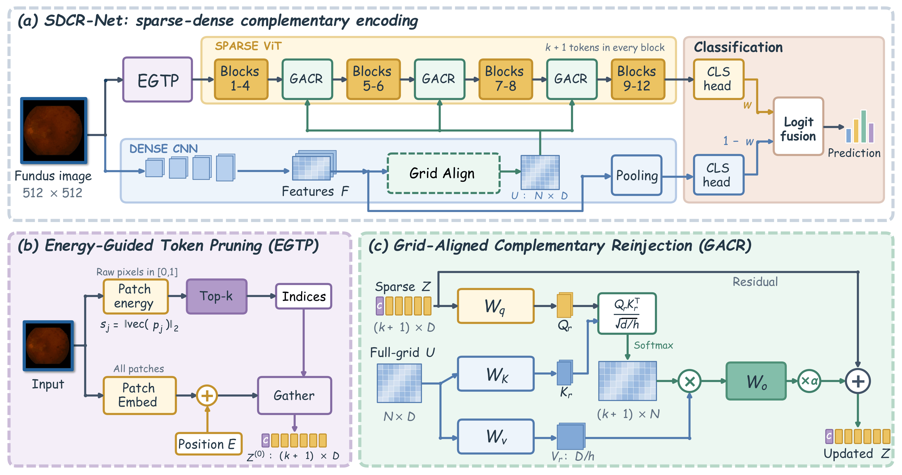

# SDCR-Net

PyTorch code for **SDCR-Net: A Sparse--Dense Complementary Reinjection Network for Retinal Disease Classification**.

Sparse ViT-B/16 models global context; dense ConvNeXt-B extracts spatial details. **EGTP** prunes tokens by patch \(L_2\) energy before the Transformer. **GACR** reinjects full-grid convolutional features into the sparse sequence.

## Framework

SDCR-Net:

<p align="center">
  
</p>

- **(a)** Sparse–dense complementary encoding
- **(b)** EGTP: parameter-free token selection before Transformer encoding
- **(c)** GACR: full-grid convolutional reinjection with sequence length \(k+1\)

## Environment

```bash
pip install -r requirements.txt
```

CUDA PyTorch is required. `timm` downloads ViT-B/16 and ConvNeXt-B weights on the first training run.

```bash
python scripts/check_forward.py
```

## Data

### MuReD

Download: [Mendeley Data — Multi-Label Retinal Diseases (MuReD)](https://data.mendeley.com/datasets/pc4mb3h8hz/1)

2,208 images, 20 disease labels. Official splits: `train_data.csv` / `val_data.csv`.

```
data/MuReD/
  train_data.csv
  val_data.csv
  images/
```

```bash
ZIP=/path/to/MuReD.zip DST=./data/MuReD bash scripts/prepare_mured.sh
```

The CSV must contain an `ID` column. If `NORMAL` exists, it is placed first; metrics exclude NORMAL by default.

### IDRiD (DME grading)

Download: [IDRiD Grand Challenge](https://idrid.grand-challenge.org/Home/)

516 high-resolution fundus images. Default task: **3-class DME** (`--idrid_task_mode dme`).

```
data/IDRiD/
  1. Original Images/a. Training Set/
  1. Original Images/b. Testing Set/
  2. Groundtruths/a. IDRiD_Disease Grading_Training Labels.csv
  2. Groundtruths/b. IDRiD_Disease Grading_Testing Labels.csv
```

Left/right black borders are cropped, then the image is padded to a square.

## Training

Defaults match the paper: $\(K=0.1\)$, $\(\alpha=0.5\)$, $\(512\times 512\)$.

```bash
bash scripts/train_mured.sh
bash scripts/train_idrid.sh
```

Equivalent command:

```bash
python train.py \
  --dataset mured \
  --data_dir ./data/MuReD \
  --vit_input_size 512 \
  --image_size 512 \
  --keep_ratio 0.1 \
  --reinject_scale 0.5 \
  --num_reinject 3 \
  --fusion_weight 0.5 \
  --lr 5e-5 \
  --lr_scheduler cosine \
  --epochs 60 \
  --batch_size 8 \
  --save_path outputs/sdcr_mured_512/best.pth
```

Checkpoint selection: MuReD uses `mAP + mF1 + AUC`; IDRiD uses accuracy. Writes `metrics.json` and `history.csv`.

## Arguments

| Argument | Meaning | Paper default |
|---|---|---|
| `--keep_ratio` | EGTP retention \(K\) | `0.1` |
| `--reinject_scale` | GACR residual \(\alpha\) | `0.5` |
| `--fusion_weight` | ViT weight \(w\) | `0.5` |
| `--vit_input_size` / `--image_size` | ViT / CNN size | `512` / `512` |
| `--selector_type` | EGTP scoring | `l2` |

Training is controlled by `train.py` CLI flags.

## File tree

```
SDCR-Net/
├── README.md
├── requirements.txt
├── train.py
├── loss.py
├── metrics.py
├── utils.py
├── figures/
│   └── framework.png
├── models/
│   ├── sdcr_net.py
│   ├── reinject.py
│   ├── token_keep.py
│   ├── vit_encoder.py
│   └── convnext_encoder.py
├── data/
│   ├── dataset.py
│   └── augmentation.py
├── configs/
│   ├── mured.yaml
│   └── idrid.yaml
└── scripts/
    ├── prepare_mured.sh
    ├── train_mured.sh
    ├── train_idrid.sh
    └── check_forward.py
```

## Forward tensors

Each DataLoader sample is a dict:

- `image`: CNN input, ImageNet-normalized
- `vit_score`: same size as ViT, **[0, 1]**, used only for EGTP \(L_2\)
- `vit_norm`: ViT input, ImageNet-normalized

EGTP must run on unnormalized pixels, not on ImageNet-normalized tensors.
